# FiTAC-MOT

**Fisheye Tracking under Appearance Changes with Temporal Memory**

FiTAC-MOT is a multi-object tracking system designed for overhead fisheye videos in which pedestrians may change clothes, accessories, pose, or apparent scale. It combines gnomonic projection, person detection, dual ReID encoders, short- and long-term appearance memories, learned temporal association, and optional AFLink post-processing.

This work was developed by **Xihao Wang** during a 2026 computer vision internship at **Caplogy Innovation**, supervised by Dr. Yassir Zardoua, Dr. Rania Othman, Dr. Joelle Jreis, and Nicolas Lutz (University of Montpellier).

[Read the full internship report](docs/FiTAC-MOT-Internship-Report.pdf) · [Implementation repository](https://github.com/xihao-wang/suivi-changement-apparence) · [Original team pipeline](https://github.com/Zardoua-Yassir/gnomonic-experimental-optimization-v2/tree/wang-main)

## Problem

Fisheye cameras provide a wide field of view, but introduce strong radial distortion and large viewpoint changes. Conventional ReID-based trackers can also lose identity continuity when a person changes clothing or accessories. FiTAC-MOT addresses both issues while retaining the detection-by-tracking structure of DeepSORT-style systems.

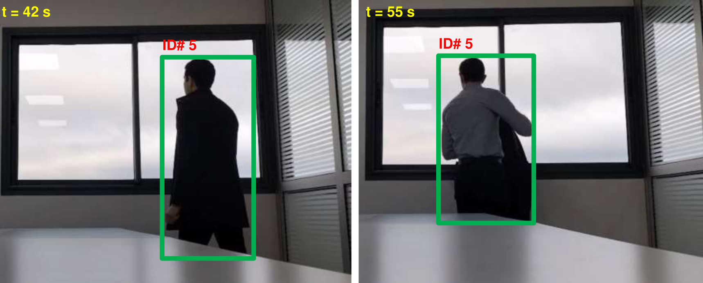

## Complete inference pipeline

1. Project the fisheye frame into overlapping gnomonic views.
2. Detect pedestrians with YOLOv9e and back-project detections into the fisheye image.
3. Apply affine correction to oriented detections to produce cleaner ReID crops.
4. Associate detections with tracks using geometric gating, OSNet appearance cost, and a learned temporal score.
5. Use Hungarian matching and temporal rescue online, then optionally reconnect fragments with AFLink.

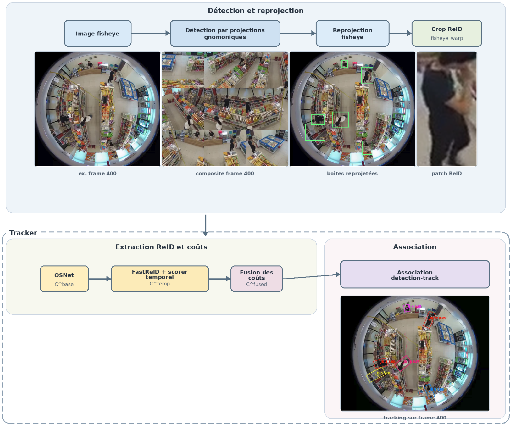

## Tracking architecture

The reference branch uses **OSNet** appearance embeddings. A temporal branch uses **FastReID** embeddings stored in a 5-frame short-term memory (STM) and a 30-frame long-term memory (LTM). A `TemporalAttentionScorer` projects the 2048-dimensional embeddings to 256 dimensions, queries STM with the current detection, and aggregates LTM with a learnable query.

The fusion network combines the detection representation, STM context, gated LTM context, and similarity statistics into a learned detection-track matching score. That score complements Kalman gating and the reference appearance cost.

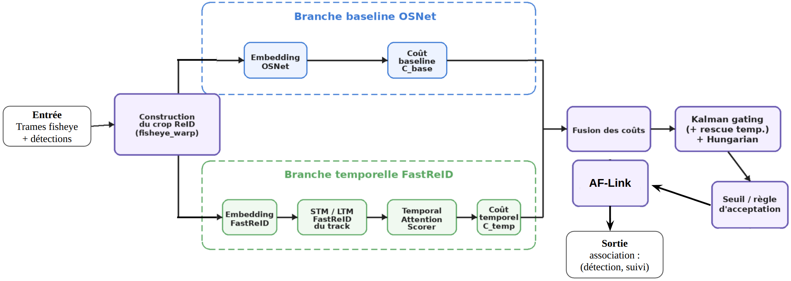

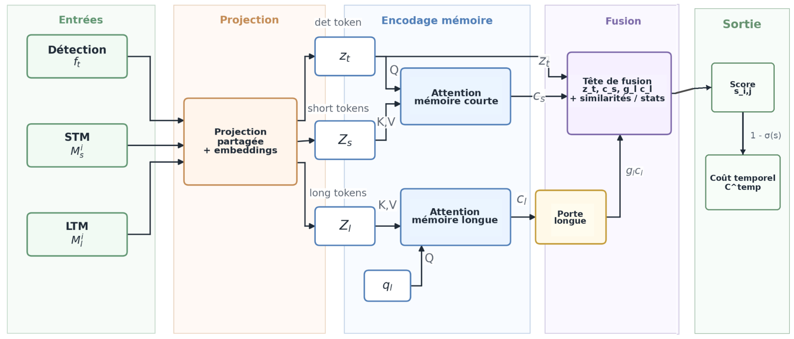

## CapFiCA dataset

CapFiCA contains **5 videos and 4,348 frames** with clothing changes, accessory changes, pose variation, partial occlusion, and multi-person crossings. MOT annotations were initialized from tracker proposals and manually corrected. Training pairs include hard negatives mined from realistic tracker candidates.

The temporal model is optimized with binary cross-entropy, InfoNCE ranking loss, and an auxiliary long-term-memory loss.

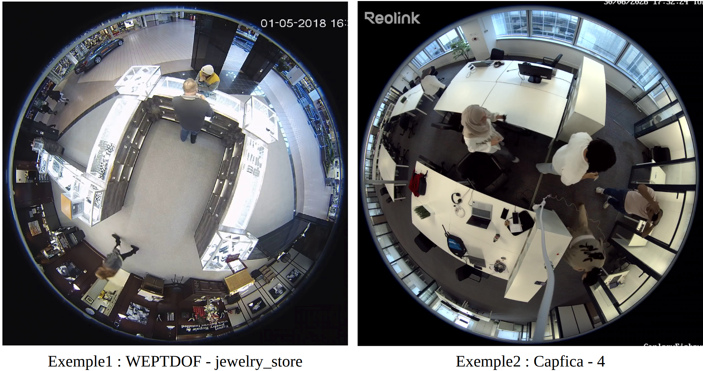

## Quantitative results

### Held-out CapFiCA4 sequence

The final checkpoint was evaluated on `capfica4`, excluded from both training and validation. All methods used the same exported detections and the historical horizontal-box TrackEval protocol.

| Method | HOTA | DetA | AssA | MOTA | IDF1 | IDSW |
|---|---:|---:|---:|---:|---:|---:|
| ByteTrack | 37.409 | 77.759 | 18.009 | 79.932 | 31.114 | **42** |
| BoT-SORT + FastReID | 36.613 | 70.575 | 19.010 | 80.197 | 32.620 | 47 |
| **FiTAC-MOT + AFLink** | **61.423** | **86.976** | **43.377** | **86.848** | **55.837** | 44 |

Without AFLink, the online FiTAC-MOT tracker reached **48.673 HOTA**, **27.238 AssA**, and **40.245 IDF1**. AFLink reconnects compatible trajectory fragments without changing detections.

### Cross-scene WEPDTOF evaluation

Across six WEPDTOF test scenes, FiTAC-MOT reached **46.573 HOTA**, **55.617 AssA**, and **56.747 IDF1**, with 17 identity switches. Under the same test protocol, ByteTrack reached 41.229 HOTA / 47.494 IDF1 and BoT-SORT + FastReID reached 40.981 HOTA / 46.948 IDF1.

## Training diagnostics

| Accuracy | Loss components |
|---|---|
| 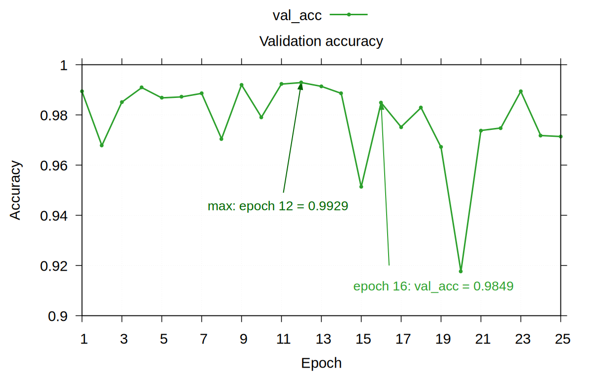 | 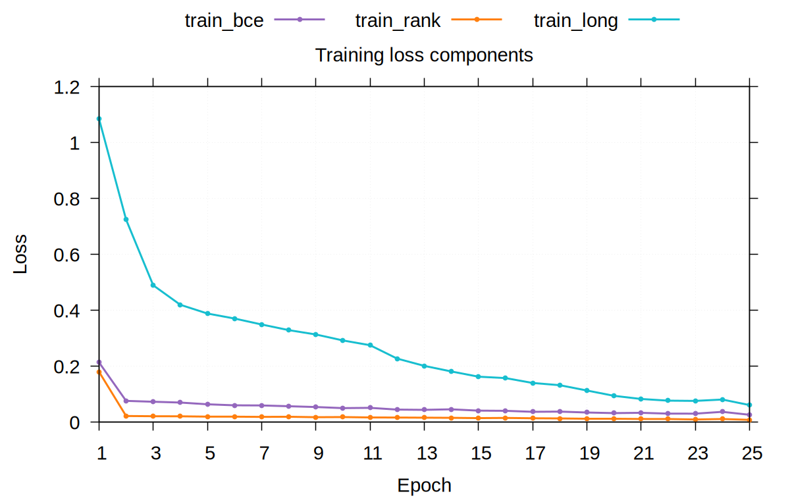 |

## Qualitative results

### Demo

<p align="center">
  
</p>

The examples below show identity continuity across fisheye distortion, crossings, occlusion, and appearance changes.

| Example 1 | Example 2 |
|---|---|
| 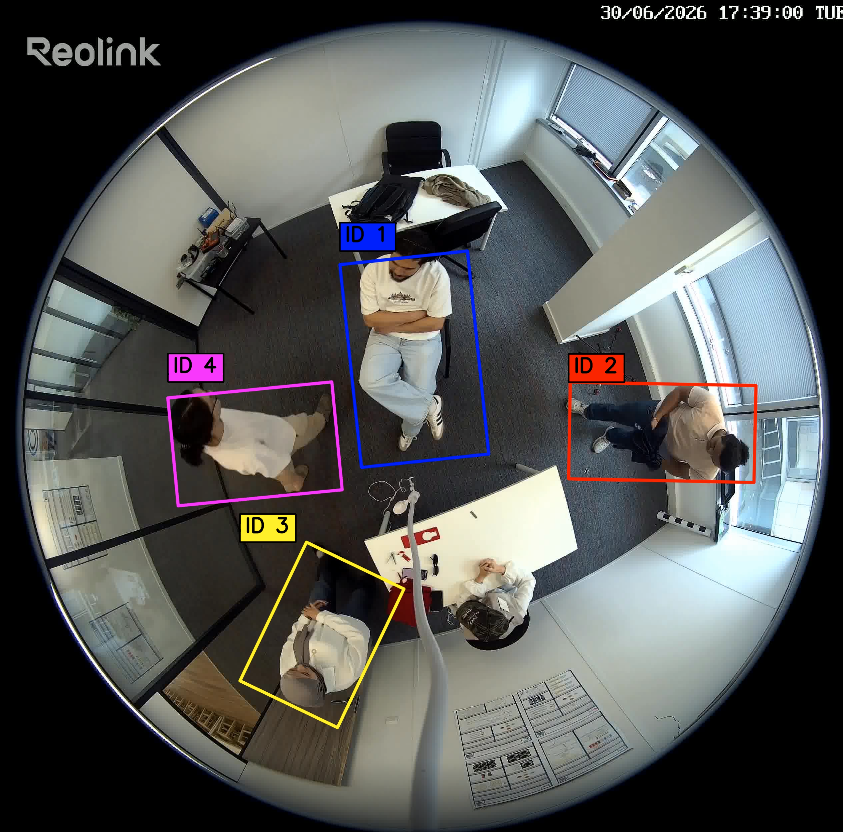 | 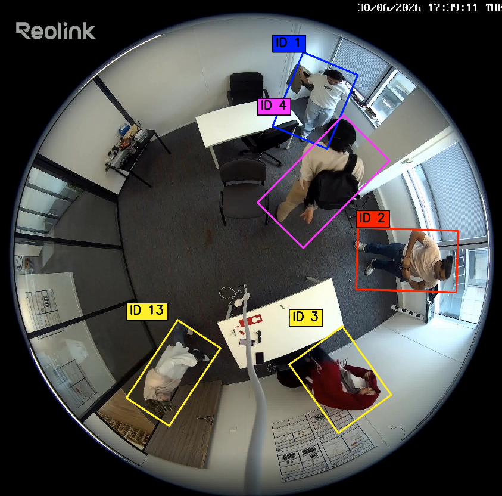 |
| 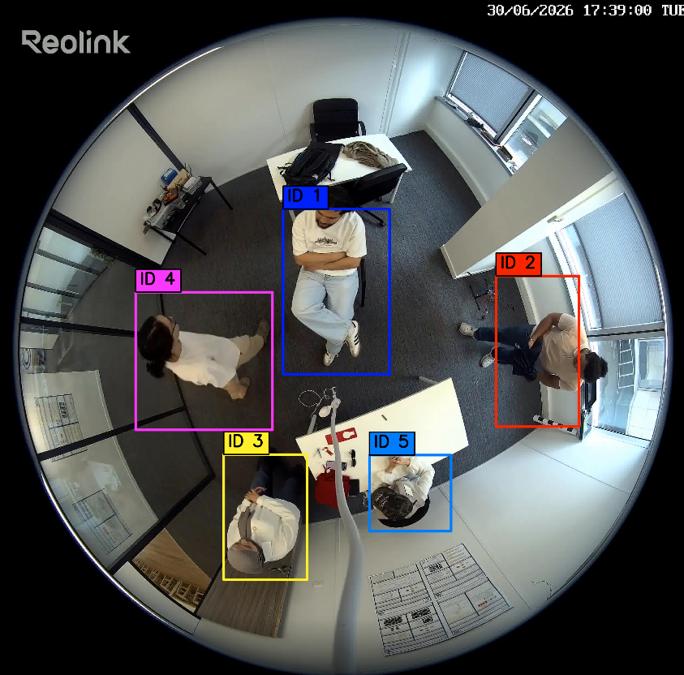 | 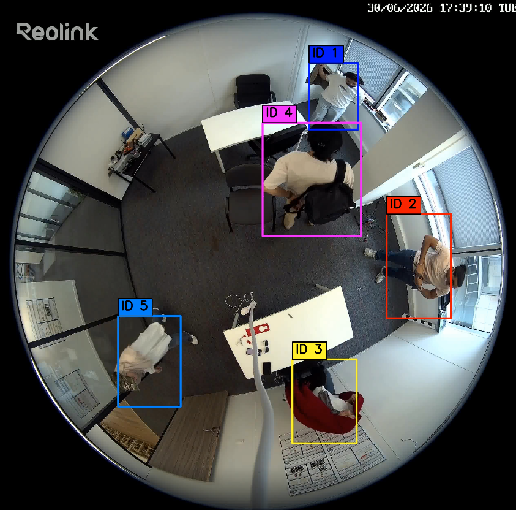 |

## My contribution

- Built the OSNet baseline and FastReID temporal branch used by FiTAC-MOT.
- Implemented STM/LTM memory handling, `TemporalAttentionScorer`, learned gating and fusion, temporal rescue, and tracker integration in PyTorch.
- Built and manually corrected CapFiCA annotations; generated training pairs and mined hard negatives from tracker proposals.
- Designed ablations and cross-scene evaluation with TrackEval, including horizontal and oriented-box protocols.
- Integrated the tracker into the fisheye/gnomonic detection pipeline and documented the complete system.

## Repository scope

This repository is the **public project presentation**: architecture, results, figures, and the internship report. The implementation remains in the linked source repositories so that project attribution and development history stay intact.

## Citation

If you refer to this project, please cite the report:

```text
Xihao Wang. FiTAC-MOT: Suivi multi-objets aux changements d'apparence
dans des videos fisheye. Internship report, Caplogy Innovation and
University of Montpellier, 2026.
```
